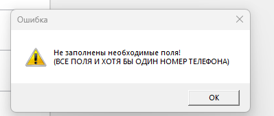

# ТЕСТОВОЕ ЗАДАНИЕ ДЛЯ DBA.
#### Использовано: WPF, ASP.NET CORE, SQLite, Dapper
## 1. Endpoints:

BACKEND URL: http://localhost:5057

При изменении настроить для WPF приложения в конфиге appsettings.json, поле BackendUrl;

| URL                                      | Описание                             |
|------------------------------------------|--------------------------------------|
| [GET] /healthcheck                       | HealthCheck                          |
| [POST] /Abonent/Add                      | Добавить Абонента                    |
| [GET] /Abonent                           | Получить список абонентов            |
| [GET] /Abonent?phoneNumber={phoneNumber} | Получить абонентов по номер телефона |
| [DELETE] /Abonent/Remove/{id}            | Удалить абонента с ID {id}           |
| [GET] /Abonent/StreetStatistics          | Получить статистику по улицам        |
| /swagger/index.html                      | Swagger                              |

## 2. Архитектура серверного приложения:
Каждый слой находится в своей библиотеки классов, для ограничения направления зависимости слоёв (Persistence слой должен знать о сущностях домена и интерфейсах репозиторией, но Application (входящий в Core) не должен знать о точной реализации логики долговременного хранения).

Слоистая (луковичная) архитектура - все внешние слои не влияют на работу внутренних слоё.

## 3. Desktop приложение (WPF):
### 3.1. Формы:

#### 3.1.1. Главная форма:

Элементы:
1. DataGrid с информацией об абонентах.
2. Кнопка "+" - Добавление нового абонента.
3. Кнопка "- синяя" - Удаление текущего (выделенного) абонента.
4. Кнопка "Изменить" - Изменение текущего (выделенного) абонента.
5. Кнопка "Поиск" - Задать фильтр по телефону.
6. Кнопка "Статистику по улицам" - Получить статистику по каждой обслуживаемой улице.
7. Кнопка "Экспорт в XML" - Экспортировать текущий Grid (с учётом фильтра и сортировок по столбцам) в XML.
8. Кнопка "- оранжевая" - Свернуть окно.
9. Кнопка "X" - Закрыть окно.
#### 3.1.2. Форма добавления/изменения абонента.

Отличие добавления и обновления: при обновлении подставляются значения из выделенного абонента.

<b>Важно</b>:
1. Поля, не считая телефонов должны быть заполнены обязательно
2. Должен быть заполнен хотя бы один телефон.
#### 3.1.3. Фильтрация по телефону:

Одно поле ввода для ввода телефона (Если ввести пустую строку, то фильтр сбросится.)

Результат фильтрации при нажатии на кнопку "ОК".

#### 3.1.4. Статистика по улицам:

### 4.2. Экспорт в XML:
При нажатии на кнопку в директории приложения (debug) создаётся папка Result (если её не существовало):

В которой находятся отчёты, названные в формате report_дд_ММ_гггг_чч_мм:

Содержания XML файла создано с учётом фильтра и порядка:

### 4.3. Предупреждения.

#### 4.3.1. Нет ответа от healthcheck:
Во время запуска приложения проверяется доступность серверного приложения через endpoint /healthcheck, если endpoint будет не доступен, будет показана ошибка без запуска приложения:

#### 4.3.2. Ошибка при вводе полей:

